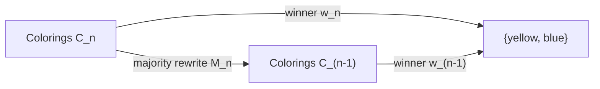

# Picture Languages and Simulation Maps

## Purpose

Jaffe and Liu distinguish a picture language `L`, a mathematical reality `R`,
and a simulation `S: L -> R`. A pictorial identity becomes a theorem about
`R` only when the simulation is proved to respect the relevant relations.

This note applies that discipline to every diagrammatic or cross-domain
construction in the repository. It is an organizational framework, not a
claim that the repository's diagrams form a TQFT, planar algebra, or quon
language.

## 1. A transport rule

Let a language `L` be generated by pictures and elementary relations. Let
`~_L` be the equivalence relation generated by those relations, and let
`S: L -> R` be a proposed simulation.

**Transport rule.** If every generating relation `a ~_L b` satisfies
`S(a) ~_R S(b)`, then `S` descends to a well-defined map from the quotient
`L / ~_L` into `R / ~_R`. Consequently, any equality derived from the
picture-language rules transports to an equality in `R`.

**Proof.** A derivation in `L` is a finite chain of generating relations,
their reverses, and compatible compositions. Soundness of every generator,
symmetry, transitivity, and compatibility with composition map that chain to
an `R`-derivation. Therefore the image depends only on the `L`-equivalence
class. This is the standard quotient construction.

The premise is essential. Visual resemblance without a sound simulation map
does not transport a theorem.

## 2. The Y-game commuting diagram

Let `C_n` be the set of complete two-color triangular boards of side `n`.
Let `M_n: C_n -> C_(n-1)` be the three-cell majority reduction, and let
`w_n: C_n -> {0,1}` be the unique Y winner.

The known path-lifting proof establishes the commuting identity

```text
w_(n-1)(M_n(B)) = w_n(B).
```

Equivalently:



Repeated commutation proves that the one-cell picture computes the original
winner. In Jaffe-Liu's terminology, the picture language is complete for this
specific query: after the soundness theorem is established, winner
computation can occur entirely through picture rewrites. This does not make
the language complete for arbitrary connectivity, influence, or probability
questions.

## 3. Cover diagrams

The same abstract Hasse syntax has two different simulations.

### Ranking-profile simulation

- `L`: finite graded diagrams whose vertices carry ballot multiplicities and
  whose directed edges increment one coordinate.
- `R`: unbounded-DP databases of rankings.
- `S`: interpret a multiplicity vector as a ballot multiset.
- **Preserved exactly:** covers are add-one-record changes; undirected graph
  distance is the `L1` distance between multiplicity vectors.

### Y-coloring simulation

- `L`: the Boolean-lattice Hasse diagram `2^(T_n)`.
- `R`: complete colorings of the triangular board.
- `S`: interpret a subset as the set of blue cells.
- **Preserved exactly:** undirected covers are one-cell recolorings; graph
  distance is Hamming distance.

The diagrams share syntax but not semantics. A theorem about ballot addition
does not automatically become a theorem about cell recoloring; only statements
expressed purely in the shared Hasse language transport without extra work.

## 4. Other simulations and their limits

| Language or representation | Target reality | Preserved quantity | Status |
|---|---|---|---|
| Pairwise sign vectors | Linear rankings | Squared Euclidean distance equals four times Kendall distance | **PROVED** |
| Random projection of sign vectors | Finite ranking family | Approximate Euclidean distances for the sampled transform | **COMPUTATIONAL; JL THEORY CONDITIONAL** |
| Three abstract rankings encoded by price, time, and size | Composite order priority | Each input ranking and hence exact Kemeny objective | **PROVED BY ENCODING** |
| Majority-triangle rewrite | Y connectivity winner | Unique winner | **KNOWN; EXHAUSTIVELY CHECKED THROUGH SIDE 6** |
| TUFT topology terminology | Kemeny/Hex program | No mathematical quantity currently specified | **HEURISTIC ONLY; NO SIMULATION MAP** |
| AI-risk scenario taxonomy | Governance-priority rankings | Category labels only, not probabilities or policy validity | **OPEN APPLICATION** |

The table distinguishes exact faithful embeddings from lossy approximations
and metaphors. In particular:

- JL distance preservation does not ensure a transitive ranking after
  projection.
- The market encoding transports computational hardness but not Carroll's
  welfare guarantee.
- TUFT motivates a local-to-global question, but no theorem is transported.
- A risk taxonomy can define alternatives for a social-choice exercise, but
  aggregation cannot manufacture calibrated empirical probabilities.

## 5. Diagram review checklist

Before a picture is used as a proof object:

1. Define its syntax and elementary rewrites.
2. Name the target theory `R`.
3. Give the simulation map `S`.
4. State the exact invariant, operation, or metric claimed to be preserved.
5. Prove soundness on generating relations.
6. Distinguish injectivity, surjectivity, approximate preservation, and
   completeness.
7. Test finite instances independently when feasible.
8. Label any remaining visual analogy as heuristic.

This checklist turns “proof by picture” into an auditable transport argument.

## Source

- Arthur M. Jaffe and Zhengwei Liu,
  [*A Mathematical Picture Language Program*](https://doi.org/10.1073/pnas.1710707114),
  *Proceedings of the National Academy of Sciences* 115(1), 2018, 81-86.
